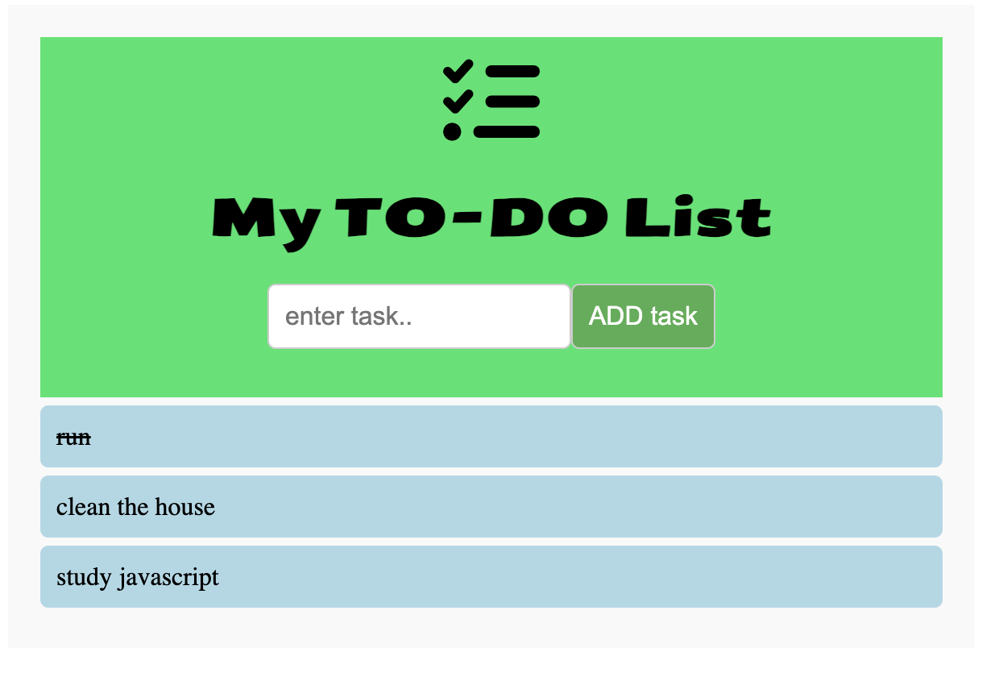

# Todo List

A simple JavaScript Todo list application that allows users to add, complete, and delete tasks. This project demonstrates basic JavaScript DOM manipulation and event handling.



## Features

- Add tasks with a single click.
- Strike through tasks to mark them as complete.
- Double-click tasks to remove them from the list.

## Setup

1. Clone the repository:
   ```sh
   git clone https://github.com/vilmaglynn/todo_list
   ```
